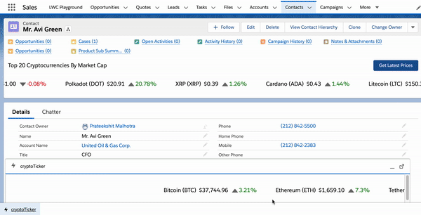
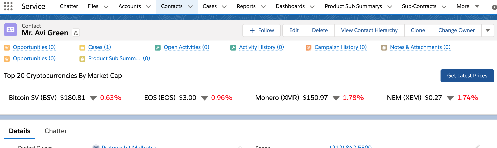
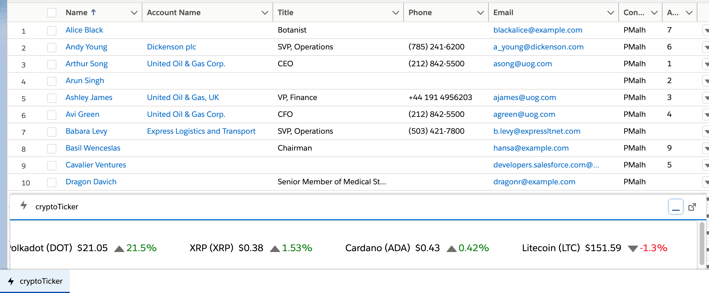
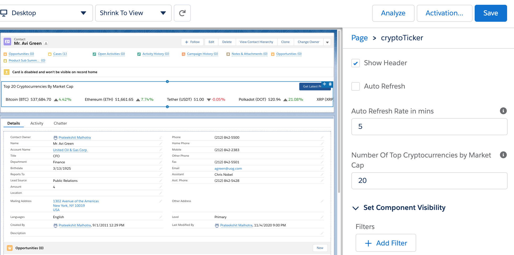

# Salesforce Crypto Ticker

Crypto Ticker is developed for fun, keeping tab of latest crazy crypto prices while working within Salesforce. The prices are loaded only once by default but can be customized to either fetch the latest prices at will by clicking the button or at a fixed time interval by configuring the component's Refresh Rate attribute. It is built using Lightning Web Component, which can be placed either on an App Page, Record Page or at my favorite place for a quick glance - Utility Bar of any App. It uses Coinmarketcap (CMC) free tier API's.

### Please Note:

- This is built just for fun and please do not make any decision to buy/sell any cryptocurrencies based on the prices shown by this app. Also, the prices may be inaccurate.
- Please use the auto refresh functionality with CAUTION, as the CMC fier tier API has a daily linit of only 333 calls.

### Crypto Ticker on Contact Record Page

### Crypto Ticker in App Utility Bar

### Installation

- Click the Deploy to Salesforce link [Deploy to Salesforce](https://githubsfdeploy.herokuapp.com/app/githubdeploy/praty23/crypto-ticker) to deploy the code in your org.

  - Please ensure to register for Coinmarketcap to get your API Key at [Coinmarketcap](https://coinmarketcap.com/api/).
  - Please use your API key as password under the deployed Coinmarketcap named credentials.
  - Place the cryptoTicker LWC in any record page, app page or app utility bar as per your convenience.
  - Configure the component attributes as per your convenience and enjoy!

  

### Todos

- Write Apex Tests
- Add Favorite Crypto Tracking
- Add Night Mode
- Add Crypto Logos

### Third-party Code

- Used [JSON2Apex](http://json2apex.herokuapp.com/) utility to generate the parser class.
- Used [Deploy2Salesforce](https://andyinthecloud.com/category/githubsfdeploy/) utility for the readme fiel.

## License

MIT
